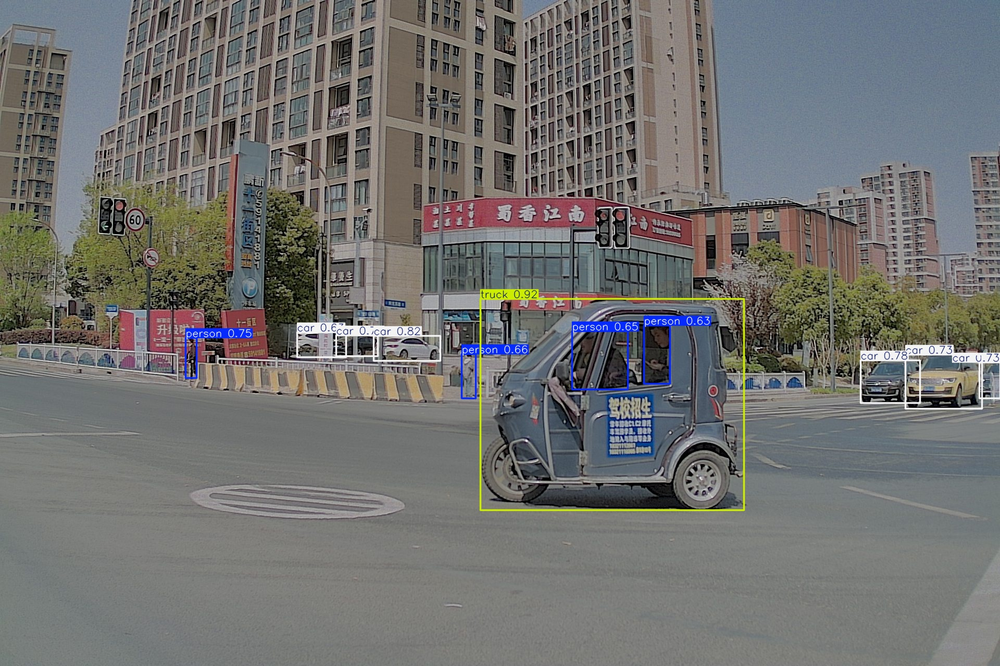

# YOLO Inference and Dataset Utilities

This directory contains a collection of Python scripts for dataset preparation and high-performance batch inference using Ultralytics YOLO models. The scripts are optimized for processing large datasets and video files efficiently.



## Installation

The primary dependencies for these scripts can be installed via pip. It is recommended to use a virtual environment.

```bash
pip install ultralytics sahi opencv-python tqdm pyav
```
- **`ultralytics`**: The core YOLO framework.
- **`sahi`**: For Slicing Aided Hyper Inference, used in **`sahiprocess.py`**.
- **`pyav`**: Required for hardware-accelerated video processing in **`processvideoblur.py`**.

---

## Scripts and Configuration

All scripts are configured by editing the parameters directly within the file, usually at the top or within the `if __name__ == '__main__':` block.

### Inference Pipelines

| Script | Description | Purpose |
| :--- | :--- | :--- |
| **`ProcessImages.py`** | Primary tool for high-performance batch inference on image directories. | Processes multiple folders, remaps classes, and generates annotated images and JSONL data. |
| **`sahiprocess.py`** | Inference using Slicing Aided Hyper Inference (SAHI). | Improves detection of small objects by processing images in overlapping tiles. |
| **`processvideoblur.py`** | Highly optimized, multi-process pipeline for video processing. | Detects and blurs faces in a video file using hardware-acceleration and a shared memory architecture for maximum speed. |

### Dataset Utilities

| Script | Description | Purpose |
| :--- | :--- | :--- |
| **`convert.py`** | Converts complex, multi-format JSON annotations into the standard YOLO `.txt` label format. | **Essential for training.** Pre-processes raw annotation data, handles multiple JSON schemas, and dynamically creates a class map. |
| **`shuffle.py`** | Splits a folder of images and their corresponding labels into `train` and `val` sets. | Creates the standard YOLO dataset structure required by the training framework. |
| **`findmore.py`** | Scans a directory of JSON annotations to discover and count all nested subcategories. | A data analysis tool to understand class distribution before training. |

---

### `ProcessImages.py`
The primary tool for high-performance batch inference on directories of images. It processes multiple folders, generates annotated images, and outputs JSONL data files.

**Configuration:**
```python
if __name__ == '__main__':
    # --- USER CONFIGURATION ---
    INPUT_FOLDERS = [
        "/home/ryan/yolov12/dynamic2dtest-100-0617-p1",
        "/home/ryan/yolov12/dynamic2dtest-100-0617-p2"
    ]
    MODEL_FILE = "bettershuffled.pt"
    
    TEXT_OUTPUT_DIRECTORY = "text_outputs"
    ANNOTATED_OUTPUT_DIRECTORY = None # Set to a path to enable, or None to disable
    
    # --- Class Remapping Control ---
    REMAP_CLASSES = False
    
    # --- Annotation Appearance & Inference Parameters ---
    # ...
```

### `sahiprocess.py`
Performs inference using Slicing Aided Hyper Inference (SAHI), which is ideal for improving the detection of small objects by processing images in overlapping tiles.

**Configuration:**
```python
if __name__ == '__main__':
    INPUT_SOURCES = [
        "/home/ryan/yolov12/dynamic2dtest-50-0617",
        # ... more paths
    ]
    MODEL_FILE = "/home/ryan/yolov12/staticobjectX.pt"
    
    TEXT_OUTPUT_DIRECTORY = "/home/ryan/Desktop/Tobecombined/static_sahi_jsonl"
    ANNOTATED_OUTPUT_DIRECTORY = "/home/ryan/Desktop/Tobecombined/sahi_runs"
    
    # --- SAHI Parameters ---
    CONFIDENCE_THRESHOLD = 0.2
    SLICE_HEIGHT = 1280
    SLICE_WIDTH = 1280
    # ...
```

### `processvideoblur.py`
A highly optimized, multi-process pipeline to detect and blur faces in a video file. It is designed for maximum throughput on high-end hardware.

**Note:** This script uses an advanced multi-process architecture with shared memory and hardware-accelerated video codecs (`h264_cuvid`, `h264_nvenc`) for performance.

**Configuration:**
```python
# --- Configuration & Hyperparameters ---
INPUT_VIDEO_PATH = Path("/home/ryan/yolov12/D2-P3-pm-2-uno-2.mp4")
OUTPUT_VIDEO_PATH = Path("video_blurred.mp4")
MODEL_PATH = Path("/home/ryan/yolov12/facedetection.pt")

# --- Pipeline Tuning ---
MAX_BATCH_SIZE = 100
CONF_THRESHOLD = 0.2
# ...
```

### `convert.py`
A powerful, two-pass script for converting complex JSON annotations into the simple `.txt` format required for YOLO training. It is specifically designed to handle multiple, inconsistent JSON schemas and intelligently filter for relevant classes based on an instance count threshold.

**Configuration:**
```python
# --- CONFIGURATION ---
# 1. Define the input and output folders.
SOURCE_JSON_DIR = '/home/ryan/yolov12/MIND_FLOW'
OUTPUT_LABELS_DIR = '/home/ryan/yolov12/templabels'

# 2. Set the minimum number of instances for a subcategory to be included.
INSTANCE_COUNT_THRESHOLD = 2000
```

### `shuffle.py`
A dataset utility to split a large, unorganized dataset of images and their corresponding labels into the standard `train` and `val` sets required for YOLO training.

**Configuration:**
```python
# --- CONFIGURATION: USER ACTION REQUIRED ---
SOURCE_IMAGES_DIR = "/home/ryan/yolov12/.../images"
SOURCE_LABELS_DIR = "/home/ryan/yolov12/.../output"
OUTPUT_DIR = "/home/ryan/yolov12/DATASETFINALVER"
VALIDATION_SPLIT_RATIO = 0.2
```

### `findmore.py`
A data analysis tool that scans a directory of JSON annotations to discover and count all nested subcategories. This is useful for understanding your dataset's class distribution before training.

**Configuration:**
```python
if __name__ == "__main__":
    # Point this to the directory with ALL your JSON files.
    json_directory = '/home/ryan/Downloads/.../MIND_FLOW'
    # ...
```
